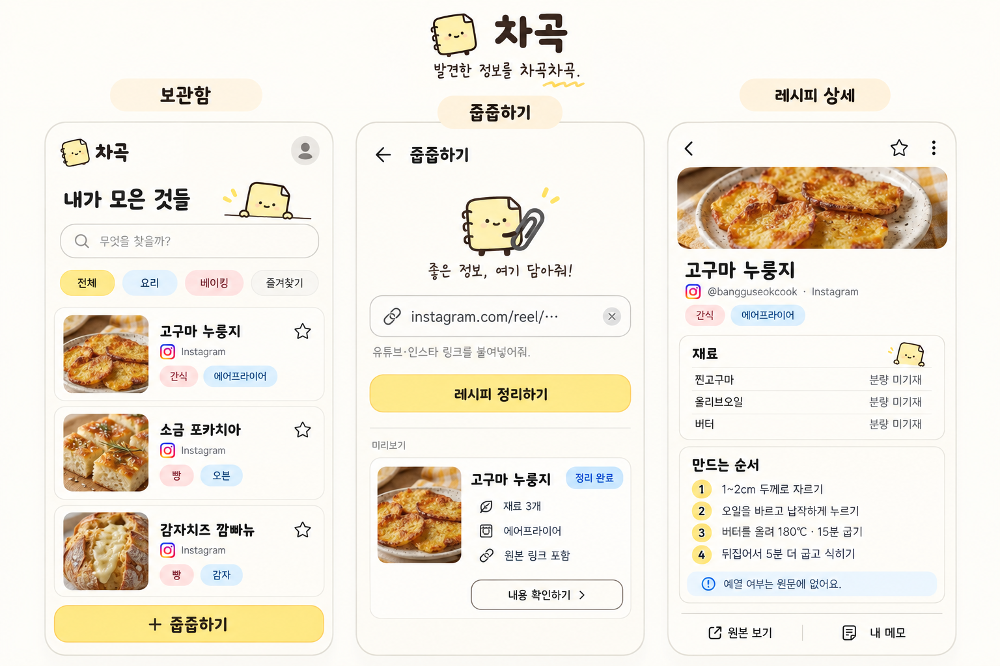

# 차곡

**발견한 정보를 차곡차곡.**

흩어진 링크와 메모를 한곳에 모아, 다시 찾기 쉬운 정보로 정리하는 개인용 모바일 웹서비스입니다.



_현재 개발 중인 제품 콘셉트입니다. 화면 이미지는 방향을 보여주는 시안이며, 실제 추출 결과를 보장하지 않습니다._

## 차곡은 무엇을 해결하나요?

좋아 보이는 레시피와 정보를 SNS에 저장해두고도 나중에 다시 찾지 못하는 문제에서 시작했습니다.

차곡은 링크, 텍스트, 직접 작성한 내용을 개인 보관함에 저장하고, 제목·본문·태그·출처로 다시 찾아볼 수 있게 합니다. 첫 번째 정보 유형은 요리·베이킹 레시피지만, 이후 러닝 팁·AI 활용법·일반 정보로 확장할 수 있는 구조를 사용합니다.

## 지금 만들고 있는 것

| 영역 | MVP 방향 |
| --- | --- |
| 입력 | 링크 가져오기, 텍스트 붙여넣기, 직접 작성 |
| 정리 | 설명 가능한 규칙 기반 후보 정리 |
| 보관 | 사용자별 비공개 보관함, 검색, 태그, 즐겨찾기 |
| 출처 | 원본 URL, 작성자, 원문 근거, 미확인 값 구분 |
| 인증 | Google 로그인, 초기 허용 계정 |
| 비용 | 무료 우선, MVP에는 AI 호출·광고·결제 없음 |

원문에 없는 재료 분량·시간·온도를 그럴듯하게 채우지 않습니다. 수집이 실패하면 실패 이유를 보여주고 캡션 붙여넣기, 참고 파일 첨부, 직접 작성으로 이어갑니다.

## 제품 원칙

- **정확하게:** 미기재, 추출 실패, 충돌을 서로 다르게 표시합니다.
- **차곡답게:** 장식보다 읽기와 다시 찾기를 우선합니다.
- **비공개로:** 사용자 데이터와 첨부 파일은 기본적으로 소유자만 봅니다.
- **무료부터:** 본인이 매주 쓰는 도구가 되는 것을 첫 성공 기준으로 삼습니다.
- **확장 가능하게:** 공통 정보 항목 위에 레시피 같은 유형별 내용을 얹습니다.

## 기술 방향

- **Web:** Next.js App Router + TypeScript
- **Auth / DB / Files:** Supabase Auth, PostgreSQL, Storage
- **Deploy:** Vercel + GitHub
- **Testing:** Vitest, Playwright
- **AI:** MVP 이후 선택 기능. 광고 시청으로 AI 분석 1회 이용권을 제공하는 방식을 검증 예정

모든 개인 데이터 테이블은 사용자 ID 기반 PostgreSQL RLS를 사용합니다. Storage는 비공개 버킷으로 운영하고, 비밀키는 저장소와 클라이언트 번들에 넣지 않습니다.

## 로컬 실행

> 현재 저장소의 첫 앱 스캐폴드는 PR [#11](https://github.com/JIHYE0705/chagok/pull/11)에서 추가되었습니다. 아래 명령으로 실행할 수 있습니다.

```bash
npm ci
npm run dev
```

개발 서버: `http://localhost:3000`

### 검증

```bash
npm run lint
npm run typecheck
npm test -- --run
npm run build
npm run test:e2e
```

Playwright Chromium이 없다면 한 번만 설치합니다.

```bash
npx playwright install chromium
```

안내 화면(`/`)은 환경 변수 없이 열 수 있습니다. 로그인에는 `.env.example`의 Supabase URL·publishable key와
앱의 고정 주소 `APP_URL`이 필요합니다. `.env.local`에 설정하고 비밀값은 GitHub에 커밋하지 않습니다.

### Supabase 클라우드 연결

개발용 Supabase 프로젝트를 생성한 뒤 프로젝트의 **Connect** 패널에서 URL과 publishable key를 확인합니다.
`.env.example`을 `.env.local`로 복사하고 두 값을 입력합니다. 앱은 클라우드의 DB·Auth·Storage에 연결하며 로컬 Supabase 서버는 필수가 아닙니다.
DB 비밀번호, personal access token, secret/service-role key는 채팅·GitHub·클라이언트 코드에 넣지 않습니다.

스키마 변경은 `supabase/migrations/`의 SQL로 관리합니다. 대시보드에서 같은 테이블을 따로 수정하지 않습니다.

```bash
npx supabase login
npx supabase link --project-ref YOUR_DEV_PROJECT_REF
npx supabase db push --dry-run
npx supabase db push
npx supabase gen types typescript --linked --schema public > lib/data/types.ts
```

CLI 로그인은 본인 터미널에서 완료하고, DB 비밀번호가 요구되면 프롬프트에 직접 입력합니다.
로그인 후에는 `/items`에서 보호된 기본 보관함을 볼 수 있습니다. 저장·검색은 후속 #5에서 구현합니다.
RLS는 소유권과 Google 허용 목록·활성 프로필을 함께 검사합니다. 허용 목록에서 삭제하거나 프로필을
`disabled`로 바꾸면 기존 세션도 데이터에 접근할 수 없습니다. `profiles.status`와 `access_allowlist`는 사용자가 수정할 수 없습니다.

### Google 로그인 설정

1. Google Cloud에서 Web OAuth 클라이언트를 만들고, 승인된 리디렉션 URI에 Supabase 프로젝트의
   `https://YOUR_PROJECT_REF.supabase.co/auth/v1/callback`을 등록합니다.
2. Supabase Auth의 Google 제공자를 활성화하고 Google client ID/secret을 설정합니다. Google secret은 앱에 넣지 않습니다.
3. Supabase의 Site URL을 앱 주소로, Redirect URLs에 앱의 `/auth/callback`을 등록합니다.
   로컬은 `http://localhost:3000/auth/callback`, 배포는 고정된 HTTPS 주소를 사용하고 `APP_URL`도 같은 origin으로 설정합니다.
4. 초대할 계정으로 한 번 Google 로그인을 시도합니다. 첫 로그인은 허용 목록이 비어 있으면 거부됩니다.
   신뢰된 Supabase SQL Editor에서 `auth.identities`의 `provider = 'google'` 행과 `auth.users`를 확인한 뒤
   해당 계정의 `provider_id`를 `access_allowlist.google_subject`에 등록합니다. 이메일이나 사용자 수정 메타데이터를 식별자로 사용하지 않습니다.
5. 다시 로그인해 `/items` 이동과 로그아웃 후 접근 차단을 확인합니다. 콜백은 고정된 `/items`로 이동하며 외부 `next` 주소를 받지 않습니다.

허용 계정은 첫 성공 콜백에서 자신의 프로필만 활성화합니다. `disabled` 프로필은 로그인으로 다시 활성화되지 않습니다.
앱 서버는 service role key를 사용하지 않습니다. Supabase의 공개 가입 허용 여부와 OAuth 설정은 운영자가 별도로 관리합니다.
참고: [Supabase SSR](https://supabase.com/docs/guides/auth/server-side/nextjs),
[Google OAuth 설정](https://supabase.com/docs/guides/auth/social-login/auth-google).

### 보관함

`/items`에서 항목 생성·조회·수정·삭제, 태그 관리, 검색과 즐겨찾기를 사용할 수 있습니다.
항목은 최근 저장순으로 24개씩 표시됩니다. 검색은 제목·요약·본문·원문·메모·태그와 레시피 재료·조리 단계·세부 정보의 부분 문자열을 찾습니다.
태그 이름은 공백과 대소문자 중복을 정리하며, 태그를 삭제하면 연결만 제거하고 항목 내용은 유지합니다.
삭제는 확인 체크가 필요하며, 저장 오류가 나면 폼 입력을 유지합니다.

항목·본문·태그 연결 저장은 `save_item`의 한 트랜잭션으로 처리합니다.
검색·태그 중복 처리·즐겨찾기 토글도 PostgreSQL에서 수행하며, 모든 함수는 기존 RLS를 따르는 `security invoker`입니다.
공통 항목 수정은 원문과 별도 레시피 세부 정보를 유지합니다. 레시피 전용 편집·규칙 기반 정리는 #6, 첨부 파일 업로드·파일 정리는 #8 범위입니다.

### 연결된 Supabase 검증

DB 검사는 Docker 대신 연결된 Supabase 프로젝트에서 실행합니다. 먼저 Supabase CLI에 로그인하고 테스트용 프로젝트를 연결합니다.
`SUPABASE_PROJECT_REF` 환경 변수를 지정하면 연결 파일 대신 해당 프로젝트를 사용합니다.

```bash
npm run test:db
npm run typecheck
npm test
npm run lint
npm run build
AUTH_E2E=1 npm run test:e2e -- --workers=1
```

`test:db`는 `supabase/tests/*.sql`의 pgTAP 결과를 모두 검사합니다.
아직 적용되지 않은 마이그레이션도 테스트 트랜잭션 안에서만 적용하고, 테스트 사용자·항목·Storage 메타데이터와 함께 롤백합니다.
기존 마이그레이션 이력과 스키마가 있어야 하며, 실제 데이터 테이블을 초기화하지 않습니다.
`rls.sql`은 사용자 소유권·교차 사용자 연결·비로그인 차단·비공개 Storage 정책,
`google_access.sql`은 초대·활성화·거부·허용 목록 삭제,
`item_library.sql`은 CRUD·태그 중복·저장 롤백·검색·필터·페이지·즐겨찾기를 검증합니다.

인증·보관함 E2E는 연결된 프로젝트의 실제 Auth 세션을 사용합니다.
브라우저 검증 전에는 새 마이그레이션을 해당 프로젝트에 적용해야 합니다.
CLI로 테스트 전용 관리자 키를 읽고 무작위 테스트 계정과 합성 Google identity를 만든 후, 종료 시 해당 계정·데이터·초대를 삭제합니다.
관리자 키는 테스트 프로세스에서만 사용하며 앱 서버에 전달하지 않습니다.
테스트 프로세스를 강제 종료하면 임시 계정이 남을 수 있으므로 실행 중인 테스트는 정상 종료해 주세요.
Google 계정 선택 화면과 실제 Google OAuth 콜백은 이 자동화에 포함되지 않습니다.

CI의 **App Checks**는 타입·단위 테스트·lint·빌드·공개 화면 E2E를 검사합니다.
**Linked Supabase DB**는 저장소 Variable `SUPABASE_PROJECT_REF`와 Secret `SUPABASE_ACCESS_TOKEN`을 설정한 경우 연결된 프로젝트에서 DB 검사를 실행합니다.
설정하지 않으면 해당 DB job은 생략됩니다. 원격 Auth 관리자 키를 쓰는 E2E는 수동으로 실행합니다.

## 개발 흐름

개발 작업은 항상 GitHub 이슈에서 시작합니다.

```text
이슈 → 기능 브랜치 → 테스트 우선 구현 → 로컬 실측 → PR → CI → main 병합 → 자동 배포
```

현재 주요 이슈:

- [#2 앱 스캐폴드](https://github.com/JIHYE0705/chagok/issues/2)
- [#3 Supabase 스키마와 RLS](https://github.com/JIHYE0705/chagok/issues/3)
- [#4 Google 로그인](https://github.com/JIHYE0705/chagok/issues/4)
- [#5 보관함·태그·검색](https://github.com/JIHYE0705/chagok/issues/5)
- [#6 직접 추가와 규칙 기반 정리](https://github.com/JIHYE0705/chagok/issues/6)
- [#7 안전한 링크 수집](https://github.com/JIHYE0705/chagok/issues/7)
- [#8 비공개 첨부 파일](https://github.com/JIHYE0705/chagok/issues/8)
- [#9 PR CI와 main 자동 배포](https://github.com/JIHYE0705/chagok/issues/9)
- [#10 개발 의존성 보안 감사](https://github.com/JIHYE0705/chagok/issues/10)

## 로드맵

### 지금 — 무료 MVP

- [x] 모바일 우선 기본 앱 셸과 Google 로그인 구현 (실제 OAuth 실측은 설정 후 진행)
- [ ] 사용자별 RLS와 비공개 Storage
- [ ] 직접 작성·텍스트 붙여넣기·링크 메타데이터
- [ ] 보관함·검색·태그·즐겨찾기
- [ ] 누락·충돌·접근 실패를 정직하게 표시

### 다음 — 사용성 검증

- [ ] 본인 실사용과 모바일·PC 재접속 검증
- [ ] 소규모 초대 사용자 테스트
- [ ] 반복 저장과 재방문 패턴 확인
- [ ] 정보 유형 확장 시나리오 검증

### 나중 — 비용이 정당화될 때

- [ ] 브라우저 로컬 AI 가능성 실험
- [ ] 광고 시청 기반 AI 분석 이용권
- [ ] 공개 가입 제어
- [ ] Kakao 로그인

## 문서

- [제품 설계](docs/superpowers/specs/2026-10-09-chagok-free-first-design.md)
- [MVP 구현 계획](docs/superpowers/plans/2026-10-09-chagok-mvp-implementation.md)
- [화면 콘셉트 원본](docs/assets/chagok-concept.png)

## 라이선스

아직 초기 개발 단계입니다. 공개 범위와 라이선스는 배포 전 확정합니다.
